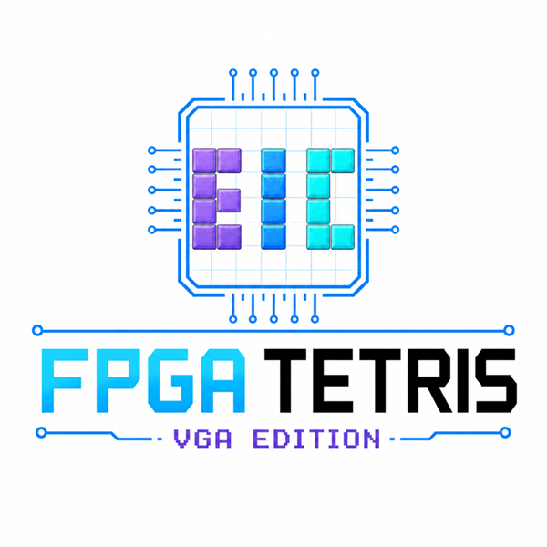

<p align="center">
  
</p>

<h1 align="center">FPGA Tetris VGA Edition</h1>

<p align="center">
  基于 FPGA 的 VGA 俄罗斯方块交互游戏系统
</p>

# FPGA Tetris VGA Edition

基于 FPGA 的 VGA 俄罗斯方块交互游戏系统。本项目使用 Digilent Nexys4 DDR 开发板，基于 Artix-7 FPGA、Vivado 2018.3 和 Verilog-2001 实现完整的俄罗斯方块游戏逻辑、VGA 图形显示、按键输入、七段数码管显示、LED 状态反馈与蜂鸣器相关扩展接口。

## 项目简介

本项目实现了一套纯硬件逻辑的俄罗斯方块游戏系统，不依赖软核 CPU。系统通过 FPGA 并行逻辑完成游戏状态机、棋盘存储、碰撞检测、方块锁定、消行、计分、等级控制、VGA 像素渲染和外设反馈。

最终系统支持：

- VGA 640×480 图形输出；
- 10×20 俄罗斯方块棋盘；
- 七种经典方块：I、O、T、S、Z、J、L；
- 方块自动下落、左右移动、旋转和软降；
- 碰撞检测、方块锁定、消行、计分和等级控制；
- 暂停、继续、Game Over 后重新开始；
- NEXT 预览、SCORE / LEVEL / LINES 信息区；
- VGA 界面 Logo 显示；
- 七段数码管显示 score 低两位和 level 两位；
- LED 状态显示和 Game Over 闪烁提示；
- 蜂鸣器相关接口预留与约束文件。

## 硬件与软件环境

| 项目 | 内容 |
|---|---|
| FPGA 开发板 | Digilent Nexys4 DDR |
| FPGA 芯片 | Artix-7 |
| 开发工具 | Vivado 2018.3 |
| 硬件描述语言 | Verilog-2001 |
| 显示输出 | VGA |
| 输入设备 | 板载按键 BTNC / BTNU / BTND / BTNL / BTNR |
| 输出设备 | VGA、七段数码管、LED、蜂鸣器接口 |

## 操作方式

| 按键 | 功能 |
|---|---|
| BTNC | 开始 / 暂停 / 继续 / Game Over 后重启 |
| BTNL | 方块左移 |
| BTNR | 方块右移 |
| BTNU | 方块旋转 |
| BTND | 软降 |

其中，BTNC 被复用为 start / pause / resume / restart。BTND 是保持型输入，按住时当前方块加速下落。系统在游戏核心中加入了 soft drop release guard，避免长按下键时跨多个新方块连续快速下落。

## 系统架构

系统顶层以 `rtl/top_vga_debug.v` 作为最终上板验证顶层。主要数据流如下：

```text
板载按键
  -> button_input / debounce / one_pulse
  -> game_core
  -> tetris_video / display / led_status / led_blink
  -> VGA / 七段数码管 / LED
```

系统可以分为三大部分：

### 1. 游戏核心逻辑

游戏核心由 `rtl/game/game_core.v` 实现，负责：

- 游戏状态机；
- 当前方块与 next 方块管理；
- 棋盘存储；
- 方块移动、旋转和软降；
- 碰撞检测；
- 方块锁定；
- 满行检测与消行；
- 分数、消行数和等级更新；
- 暂停、继续和 Game Over 后重启。

游戏核心采用 candidate 机制处理移动和旋转：先生成候选位置或候选旋转状态，经过边界和棋盘碰撞检查后再提交。这样可以避免旋转失败或移动失败时方块进入非法状态。

### 2. VGA 显示与 UI

VGA 显示由 `rtl/video/vga_timing.v` 和 `rtl/video/tetris_video.v` 实现。

`vga_timing.v` 负责产生 640×480 VGA 时序，包括像素坐标、有效显示区域、行同步和场同步信号。

`tetris_video.v` 负责根据当前像素位置实时渲染画面，包括：

- 棋盘边框和网格；
- 已锁定方块；
- 当前活动方块；
- NEXT 预览；
- SCORE / LEVEL / LINES 信息区；
- 标题、Game Over、操作提示文字；
- 团队 Logo。

当前活动方块不写入棋盘，而是在 VGA 显示阶段根据 `cur_piece_type`、`cur_piece_rot`、`cur_piece_x`、`cur_piece_y` 实时叠加显示。暂停状态 `GS_PAUSE` 下仍然显示活动方块，实现“逻辑暂停、画面冻结”的效果。

Logo 显示由 `rtl/video/logo_rom.v` 和 `rtl/video/logo_128x128.mem` 实现。

### 3. 输入输出外设

输入模块包括：

- `rtl/io/button_input.v`
- `rtl/io/debounce.v`
- `rtl/io/one_pulse.v`

其中，`debounce.v` 完成按键同步和消抖，`one_pulse.v` 将事件型按键转换为单周期脉冲，`button_input.v` 统一输出游戏核心需要的 start、left、right、rotate 和 soft drop 信号。

七段数码管显示由：

- `rtl/io/display.v`
- `rtl/io/seven_seg_driver.v`

实现。当前显示 score 低两位和 level 两位，并使用 S / L 标签区分分数和等级。

LED 反馈由：

- `rtl/io/led_status.v`
- `rtl/io/led_blink.v`

实现。非 Game Over 状态下显示游戏状态；Game Over 状态下由 `led_blink.v` 控制 LED 闪烁。顶层通过 mux 合并两个 LED 输出，避免多驱动。

蜂鸣器相关逻辑位于：

- `rtl/io/beep.v`
- `constraints/beep.xdc`

当前主要作为外设扩展接口保留。

## 项目目录

```text
fpga_tetris/
├── constraints/              # Nexys4 DDR 引脚约束
│   ├── Nexys4DDR.xdc
│   ├── seven_seg_ports.xdc
│   └── beep.xdc
│
├── docs/                     # 设计文档与调试记录
│   ├── debug_log.md
│   ├── demo_script.md
│   ├── interface_spec.md
│   ├── project_plan.md
│   └── work_division.md
│
├── local_report_files/       # 实验报告与图片材料
│   ├── logo.jpg
│   ├── logo_original.png
│   ├── report.tex
│   └── figures/
│
├── rtl/                      # RTL 源码
│   ├── top.v
│   ├── top_minimal_debug.v
│   ├── top_vga_debug.v
│   ├── common/
│   ├── game/
│   ├── io/
│   └── video/
│
├── sim/                      # 仿真 testbench
│   ├── tb_game_core.v
│   ├── tb_button_input.v
│   ├── tb_display.v
│   └── ...
│
└── vivado/                   # Vivado 工程目录
    └── fpga_tetris/
        └── fpga_tetris.xpr
```

说明：`vivado/` 目录中包含 Vivado 自动生成的缓存、综合实现结果、仿真中间文件和 bitstream。README 中不展开这些文件，实际开发时主要关注 `fpga_tetris.xpr`、RTL 源码、约束文件和报告材料。

## 主要文件说明

| 文件 | 说明 |
|---|---|
| `rtl/top_vga_debug.v` | 最终上板验证顶层 |
| `rtl/game/game_core.v` | 游戏核心状态机与规则逻辑 |
| `rtl/game/piece_rom.v` | 方块形状 ROM |
| `rtl/game/random_lfsr.v` | 伪随机方块生成 |
| `rtl/game/score_level.v` | 分数、行数和等级管理 |
| `rtl/video/tetris_video.v` | VGA 画面渲染与 UI 显示 |
| `rtl/video/vga_timing.v` | VGA 时序发生器 |
| `rtl/video/logo_rom.v` | Logo ROM |
| `rtl/video/logo_128x128.mem` | Logo 像素数据 |
| `rtl/io/button_input.v` | 按键输入整合 |
| `rtl/io/debounce.v` | 按键消抖 |
| `rtl/io/one_pulse.v` | 上升沿单周期脉冲 |
| `rtl/io/display.v` | 七段数码管显示调度 |
| `rtl/io/seven_seg_driver.v` | 七段数码管段码和位选驱动 |
| `rtl/io/led_status.v` | LED 状态显示 |
| `rtl/io/led_blink.v` | Game Over LED 闪烁 |
| `rtl/io/beep.v` | 蜂鸣器扩展模块 |
| `constraints/Nexys4DDR.xdc` | 主约束文件 |
| `constraints/seven_seg_ports.xdc` | 七段数码管约束 |
| `constraints/beep.xdc` | 蜂鸣器约束 |
| `docs/interface_spec.md` | 模块接口说明 |
| `docs/debug_log.md` | 调试过程记录 |
| `local_report_files/report.tex` | 实验报告 LaTeX 源文件 |

## 仿真验证

项目包含多个 testbench，用于验证核心模块和外设模块。主要包括：

| Testbench | 验证内容 |
|---|---|
| `sim/tb_game_core.v` | 游戏核心状态机、start/pause/restart、soft drop、旋转、level-speed 等 |
| `sim/tb_button_input.v` | 按键输入链路 |
| `sim/tb_debounce.v` | 消抖逻辑 |
| `sim/tb_one_pulse.v` | 单周期脉冲生成 |
| `sim/tb_display.v` | 七段数码管显示扫描 |
| `sim/tb_seven_seg_driver.v` | 七段数码管段码和位选 |
| `sim/tb_collision_check.v` | 碰撞检测 |
| `sim/tb_line_clear.v` | 消行逻辑 |
| `sim/tb_score_level.v` | 分数与等级更新 |
| `sim/tb_vga_timing.v` | VGA 时序验证 |

在 Vivado XSim 中可分别选择对应 testbench 作为仿真顶层，运行：

```tcl
restart
run all
```

## Vivado 使用说明

推荐使用 Vivado 2018.3。

### 方法一：直接打开工程

如果需要直接复现当前工程，可以打开：

```text
vivado/fpga_tetris/fpga_tetris.xpr
```

打开后确认综合顶层为：

```text
top_vga_debug
```

然后依次运行：

1. Run Synthesis
2. Run Implementation
3. Generate Bitstream
4. Program Device

### 方法二：重新创建工程

也可以在 Vivado 中新建工程，并手动添加以下文件：

- `rtl/` 下全部 Verilog 源文件；
- `constraints/Nexys4DDR.xdc`；
- `constraints/seven_seg_ports.xdc`；
- 如需蜂鸣器扩展，添加 `constraints/beep.xdc`；
- `rtl/video/logo_128x128.mem`。

然后将顶层设置为：

```text
top_vga_debug
```

并运行综合、实现和生成 bitstream。

## 上板验证

上板前请确认：

- VGA 显示器已连接开发板 VGA 接口；
- 约束文件已正确加入工程；
- 顶层为 `top_vga_debug`；
- `logo_128x128.mem` 能被 Vivado 工程找到；
- bitstream 已成功生成。

上板验证重点：

- VGA 是否显示游戏画面；
- BTNC 是否能开始、暂停、继续和重启；
- BTNL / BTNR / BTNU / BTND 是否能控制移动、旋转和软降；
- 暂停时当前方块是否仍然显示；
- 长按 BTND 是否不会跨多个方块连续快速下落；
- SCORE / LEVEL / LINES 是否正常显示；
- NEXT 预览和 Logo 是否正常；
- 七段数码管是否显示 score 低两位和 level 两位；
- Game Over 后 LED 是否闪烁。

## 资源优化

项目早期曾尝试使用完整棋盘扁平化总线和大规模组合逻辑进行消行、碰撞和显示查询，导致 LUT 占用过高。最终版本采用多拍顺序 FSM 和单格棋盘查询接口，显著降低资源占用。

主要优化包括：

- 删除完整棋盘扁平化输出；
- 使用 `board_query_row / board_query_col / board_cell_value` 单格查询接口；
- 方块锁定多拍写入；
- 清行过程多拍 FSM 处理；
- 碰撞检测采用候选状态检查后提交；
- VGA 显示实时查询当前像素对应 cell。

## 团队分工

| 成员 | 分工 |
|---|---|
| phr | 项目整体规划、游戏核心逻辑设计，负责 `game_core`、状态机、碰撞检测、消行、计分等级、资源优化与核心仿真 |
| lhx | VGA 显示与 UI 设计，负责 `vga_timing`、`tetris_video`、文字/数字显示、NEXT 预览、Logo 显示与 VGA 上板调试 |
| zbsj | 输入输出外设设计，负责 `button_input`、按键消抖、单周期脉冲、七段数码管、LED 状态与 Game Over 闪烁及蜂鸣器 |
| co | 系统集成、Vivado 综合实现、bitstream 生成、上板联调、Git 协作与文档整理 |

## 实验报告

实验报告及相关图片位于：

```text
local_report_files/
```

其中包含：

- `report.tex`：LaTeX 报告源文件；
- `figures/`：仿真波形图和上板实拍图；
- `logo.jpg`：报告和项目使用的 Logo 图片。

## 当前状态

项目已完成核心功能集成，并完成阶段性上板验证。最终版本支持 VGA 显示、按键交互、七段数码管显示、LED 状态反馈和报告材料归档。

## 后续可扩展方向

- 增加 Wall Kick，提高贴墙旋转体验；
- 增加 Ghost Piece 显示；
- 使用 Clocking Wizard 生成更规范的 VGA 像素时钟；
- 完善蜂鸣器音效反馈；
- 增加更完整的 VGA testbench。
